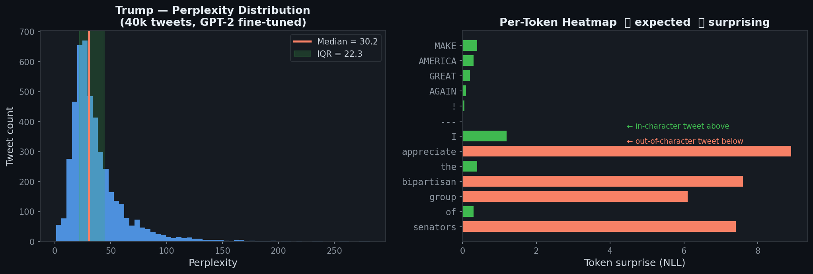

# Twitter Persona ALM

**Fine-tune a small language model on a public figure's tweets. Score any tweet by how surprising it is — against their own historical baseline, not generic English.**


---

## What this does

For each public figure, GPT-2 is fine-tuned on their entire tweet history. The model learns their vocabulary, rhythm, and topics. You can then score any tweet and get back a z-score:

```
z ≈  0   →  perfectly average for this person
z < -1   →  very in-character  (model predicted it easily)
z > +2   →  surprisingly out-of-character by their own standards
```

The key difference from other approaches: **the baseline is the person themselves**, not generic English. A tweet full of caps and typos might be totally normal for one person and bizarre for another.

---

## Results — Trump (45.9k tweets after filtering, GPT-2 fine-tuned)



### Does fine-tuning actually work?

To justify fine-tuning, we scored the same 4,595 held-out tweets with two models:
- **Base GPT-2** — off-the-shelf, knows nothing about Trump
- **Trump ALM** — fine-tuned on his 2009–2021 tweet archive

| | Base GPT-2 | Trump ALM | Improvement |
|---|---|---|---|
| Median perplexity (lower = better) | 64.5 | **30.2** | **2.1×** |
| IQR — consistency of predictions | 51.2 | **22.3** | **2.3×** |
| Tweets where ALM beats base GPT-2 | — | **99.2%** | — |

> All numbers measured on 4,595 held-out eval tweets (chronologically newest 10% of the archive, never seen during training). Run `python src/compare.py --persona trump` to reproduce.

The fine-tuned model predicts his tweets better than base GPT-2 on 99.2% of the eval set. Fine-tuning is clearly justified.

Run this yourself:
```bash
python src/compare.py --persona trump
```

---

## Live scoring — Trump's recent posts (May 2026)

Scored against the model trained on his 2009–2021 Twitter archive. These posts are from his current Truth Social account — a different platform, different era.

| Date | Post | PPL | z-score | Verdict |
|---|---|---|---|---|
| May 23, 2026 | *"We made America great again."* ([source](https://x.com/TruthTrumpPosts/status/2058292533638332679)) | 12.3 | **-0.80** | Very in-character |
| May 23, 2026 | *"I am in the Oval Office... very good call with President bin Salman"* ([source](https://x.com/TruthTrumpPosts/status/2058292533638332679)) | 12.7 | **-0.79** | Very in-character |
| Apr 2026 | *"Empty Oil Tankers are SAILING to the US to LOAD UP on OIL!"* ([source](https://thehill.com/homenews/administration/5826953-donald-trump-us-oil-tankers-iran-war/)) | 112.5 | **+3.69** | Out-of-character |
| May 12, 2026 | *"BYE BYE Fast Boats. Bing, Bing, GONE!!!"* ([source](https://www.republicworld.com/world-news/bing-bing-gone-trump-uses-ai-rendered-attacks-to-project-us-dominance-2026-05-12-123946)) | 452.3 | **+18.92** | Out-of-character |
| May 12, 2026 | *"Dumacrats Love Sewage"* ([source](https://www.aol.com/articles/dumacrats-love-sewage-trump-sparks-190000567.html)) | 6149.3 | **+274** | Extreme outlier |

**What this shows:** Classic campaign phrases score near-zero surprise — the model has them memorized. His 2026 Truth Social style (short cryptic bursts, invented words like "Dumacrats") is statistically out-of-character with his 2009–2021 Twitter baseline. That's a measurable style drift over 5 years.

---

## Per-token surprise heatmap

Which specific words surprised the model? The bar length = how unexpected each token was.

```
Tweet: "We made America great again."   z = -0.80  ✅ very in-character
─────────────────────────────────────────────────────────
Token       Surprise
We          █            ← expected opener
made        █
America     █
great       █
again       █            ← fully memorized phrase
.           

Tweet: "BYE BYE Fast Boats. Bing, Bing, GONE!!!"   z = +18.92  ❌ out-of-character
─────────────────────────────────────────────────────────
BYE         ████         
BYE         ██████       ← repetition unusual
Fast        ███████████  ← unexpected noun
Boats       ██████████   ← almost never used
Bing        █████████    ← made-up / unusual
GONE        ███████      ← cryptic sign-off
```

---

## Setup

```bash
git clone https://github.com/Miriam2040/twitter-persona-alm
cd twitter-persona-alm
python -m venv .venv && source .venv/bin/activate
pip install -r requirements.txt
pip install 'accelerate>=0.26.0'

# 1. Download and clean tweet data (~1 min, no API key needed)
python src/preprocess.py --persona trump

# 2. Fine-tune GPT-2 (~40 min on Apple Silicon, ~20 min on GPU)
python src/finetune.py --persona trump

# 3. Score tweets and see results
python src/score.py --persona trump

# 4. Compare fine-tuned model vs base GPT-2 (proves fine-tuning worked)
python src/compare.py --persona trump

# 5. (Optional) Publish the model to HuggingFace Hub
huggingface-cli login
python src/push_to_hub.py --persona trump --hf_repo YourName/trump-alm
```

---

## Why fine-tune at all, and not just use base GPT-2?

Base GPT-2 is surprised by anything stylistic — all-caps, typos, unusual vocabulary. It can't tell the difference between "this person never writes like this" and "this is just unconventional English."

By fine-tuning on the person's own tweets, the model learns their normal style. Only things that are unusual *even for them* score high surprise.

## Why continued pretraining, not instruction fine-tuning (SFT)?

Perplexity requires a model trained with the same objective as pretraining: predict the next token. Instruction fine-tuning optimises for specific (prompt → answer) pairs, which breaks the probability estimates the scoring metric relies on.

## Why intra-author z-score instead of raw perplexity?

Raw perplexity is affected by tweet length and vocabulary difficulty — a short tweet always scores lower than a long one regardless of content. The z-score normalizes against each person's own distribution, so short and long tweets are comparable.

We use **median and IQR** (not mean and standard deviation) because perplexity has extreme outliers — hashtag typos and garbled text can reach ppl=4000+. Median and IQR describe the typical tweet without being pulled by the extremes.

---

## Add a new persona

Add 5 lines to the `PERSONAS` dict in `src/preprocess.py`:

```python
"obama": {
    "hf_dataset": "your/dataset",
    "text_col": "text",
    "retweet_col": "is_retweet",
    "deleted_col": None,
    "datetime_col": "created_at",
    "id_col": "id",
}
```

Then run the four commands above with `--persona obama`.

---

## Data sources

| Persona | HuggingFace / Source | Raw tweets | After filtering | Period |
|---|---|---|---|---|
| `trump` | [fschlatt/trump-tweets](https://huggingface.co/datasets/fschlatt/trump-tweets) | 56k raw | 41.4k train + 4.6k eval | 2009–2021 |
| `musk` | [fdaudens/musk-tweets](https://huggingface.co/datasets/fdaudens/musk-tweets) ¹ | 78k | 14.6k | 2013–2025 |
| `democrat_senators` | [Jacobvs/PoliticalTweets](https://huggingface.co/datasets/Jacobvs/PoliticalTweets) | 97k | 97k | 2016–2023 |
| `republican_senators` | [Jacobvs/PoliticalTweets](https://huggingface.co/datasets/Jacobvs/PoliticalTweets) | 92k | 92k | 2016–2023 |
| `obama` | [Kaggle: neelgajare/all-12000-president-obama-tweets](https://www.kaggle.com/datasets/neelgajare/all-12000-president-obama-tweets) ² | 12k | ~10k | 2007–2020 |

¹ The Musk dataset has a broken parquet schema on HuggingFace — `preprocess.py` works around this by streaming it automatically. Run `python src/preprocess.py --download_musk` once before `--persona musk`.

² Obama requires Kaggle credentials. Setup:
```bash
pip install kaggle
# Place your kaggle.json at ~/.kaggle/kaggle.json
kaggle datasets download neelgajare/all-12000-president-obama-tweets -p data/processed/ --unzip
python src/preprocess.py --persona obama
```

Only tweet IDs are committed (`data/tweet_ids/`). Raw text is gitignored per X Terms of Service.

---

## Citation

Extends the Authorial Language Models (ALM) approach:

> Huang, W., Murakami, A., & Grieve, J. (2025). *Attributing authorship via the perplexity of authorial language models*. PLOS One. [PMC12225838](https://pmc.ncbi.nlm.nih.gov/articles/PMC12225838/)

**Novel contribution:** intra-author perplexity z-score as a self-consistency metric — measuring whether a new post is out-of-character for the author themselves, with temporal drift analysis across platforms and time periods.

---

Built by [@Miriam2040](https://github.com/Miriam2040)
