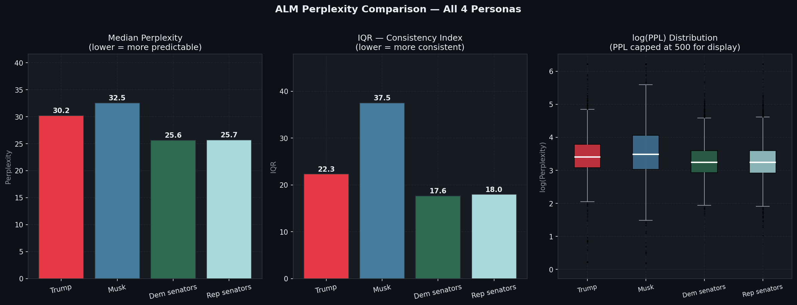
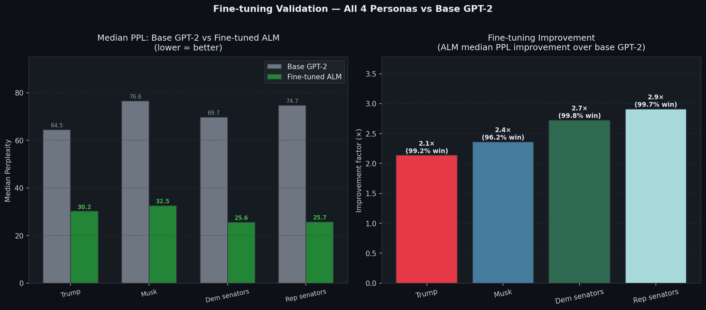

# Twitter Persona ALM

**Fine-tune a small language model on a public figure's tweets. Score any tweet by how surprising it is — against their own historical baseline, not generic English.**


---

## What this does

For each public figure, GPT-2 is fine-tuned on their entire tweet history. The model learns their vocabulary, rhythm, and topics. You can then score any tweet and get back a z-score:

```
z ≈  0   →  perfectly average for this person
z < -1   →  very in-character  (model predicted it easily)
z > +2   →  surprisingly out-of-character by their own standards
```

The key difference from other approaches: **the baseline is the person themselves**, not generic English. A tweet full of caps and typos might be totally normal for one person and bizarre for another.

---

## Results — All 4 personas



### Fine-tuning validation — all personas beat base GPT-2



| Persona | Train tweets | Eval tweets | Base GPT-2 median PPL | ALM median PPL | Improvement | ALM win rate |
|---|---|---|---|---|---|---|
| Trump | 41,351 | 4,595 | 64.5 | **30.2** | **2.1×** | **99.2%** |
| Musk | 9,866 | 1,097 | 76.6 | **32.5** | **2.4×** | **96.2%** |
| Democrat senators | 88,076 | 9,787 | 69.7 | **25.6** | **2.7×** | **99.8%** |
| Republican senators | 83,303 | 9,256 | 74.7 | **25.7** | **2.9×** | **99.7%** |

> All numbers measured on chronologically held-out eval tweets (newest 10%, never seen during training).
> Reproduce any row: `python src/compare.py --persona trump`

---

## Key finding — consistency ranking

| Persona | Median PPL | IQR (chaos index) | Interpretation |
|---|---|---|---|
| Dem senators | 25.6 | **17.6** | Most consistent — party talking points memorized |
| Rep senators | 25.7 | **18.0** | Nearly identical to Dems |
| Trump | 30.2 | 22.3 | More variable than either party collectively |
| Musk | 32.5 | **37.5** | Most chaotic — 2.1× more variable than senators |

**IQR = interquartile range of perplexity** — a low IQR means the model is consistently surprised to the same degree. A high IQR means the person is all over the map.

**The insight:** Democrat and Republican senators are statistically indistinguishable in consistency (IQR 17.6 vs 18.0). Two opposing parties, same robotic predictability. Both are more consistent than Trump alone, who is more consistent than Musk.

### What the model memorized per persona

**Trump** — Fox News interview announcements:
> *"Will be interviewed on @foxandfriends at 8:00 A.M. Enjoy!"* → PPL **1.8**

**Democrat senators** — party talking points:
> *"I support a woman's right to make her own healthcare decisions."* → PPL **3.2**

**Republican senators** — media appearances + slogans:
> *"Border security is national security."* → PPL **2.8**

**Musk** — emoji strings and broadcast links. Most typical real sentence (z≈0):
> *"Teachers in California spend their time indoctrinating kids in DEI racism & sexism"* → PPL **26.7**

---

## Optional robustness check: CAC-strict

`CAC-strict` is a contrastive robustness metric for author-consistency scorers.
It checks whether a scorer ranks authentic held-out author text above minimally
corrupted variants of the same text. The benchmark is pairwise and reports one
headline score: macro-averaged strict accuracy across nonce substitution,
common-token swap, and adjacent content-word swap perturbations.

See [docs/cac_strict.md](docs/cac_strict.md) for the protocol and CLI.
CAC-strict can be run from the CLI or called from another evaluation runner:
generate `texts_to_score.jsonl`, score those texts with any method, then
evaluate the resulting `text_id,author_consistency_score` CSV.

Smoke test:

```bash
python src/cac_strict.py --persona trump --sample-size 30 --scorer lexical
```

On the current Trump processed split (41,351 train / 4,595 eval rows), this
generates 90 contrastive pairs and the bundled lexical smoke scorer reports
CAC-strict = 60.0%. Use the same command with another processed `--persona`, or
pass explicit split CSVs for a different scorer workflow.

---

## Live scoring — Trump's recent posts (May 2026) 🟥 Trump only

> This section is Trump-specific. The same analysis can be run for any persona using `src/score_live_tweets.py` — just add posts to the `LIVE_POSTS` dict.

Scored against the Trump ALM trained on his 2009–2021 Twitter archive. These posts are from his current Truth Social account — a different platform, different era.

| Date | Post | PPL | z-score | Verdict |
|---|---|---|---|---|
| May 23, 2026 | *"We made America great again."* ([source](https://x.com/TruthTrumpPosts/status/2058292533638332679)) | 12.3 | **-0.80** | Very in-character |
| May 23, 2026 | *"I am in the Oval Office... very good call with President bin Salman"* ([source](https://x.com/TruthTrumpPosts/status/2058292533638332679)) | 12.7 | **-0.79** | Very in-character |
| Apr 2026 | *"Empty Oil Tankers are SAILING to the US to LOAD UP on OIL!"* ([source](https://thehill.com/homenews/administration/5826953-donald-trump-us-oil-tankers-iran-war/)) | 112.5 | **+3.69** | Out-of-character |
| May 12, 2026 | *"BYE BYE Fast Boats. Bing, Bing, GONE!!!"* ([source](https://www.republicworld.com/world-news/bing-bing-gone-trump-uses-ai-rendered-attacks-to-project-us-dominance-2026-05-12-123946)) | 452.3 | **+18.92** | Out-of-character |
| May 12, 2026 | *"Dumacrats Love Sewage"* ([source](https://www.aol.com/articles/dumacrats-love-sewage-trump-sparks-190000567.html)) | 6149.3 | **+274** | Extreme outlier |

**What this shows:** Classic campaign phrases score near-zero surprise — the model has them memorized. His 2026 Truth Social style (short cryptic bursts, invented words like "Dumacrats") is statistically out-of-character with his 2009–2021 Twitter baseline. Measurable style drift over 5 years.

---

## Per-token surprise heatmap — Trump examples 🟥 Trump only

> These examples use the Trump ALM. Run `python src/score.py --persona <name>` to get per-token breakdowns for any persona.

Which specific words surprised the model? The bar length = how unexpected each token was.

```
Tweet: "We made America great again."   z = -0.80  ✅ very in-character  [Trump ALM]
─────────────────────────────────────────────────────────
Token       Surprise
We          █            ← expected opener
made        █
America     █
great       █
again       █            ← fully memorized phrase
.           

Tweet: "BYE BYE Fast Boats. Bing, Bing, GONE!!!"   z = +18.92  ❌ out-of-character
─────────────────────────────────────────────────────────
BYE         ████         
BYE         ██████       ← repetition unusual
Fast        ███████████  ← unexpected noun
Boats       ██████████   ← almost never used
Bing        █████████    ← made-up / unusual
GONE        ███████      ← cryptic sign-off
```

---

## Trained models on HuggingFace

All models are GPT-2 (117M) fine-tuned via continued pretraining (causal LM). Use them directly for inference — no training needed.

| Persona | Model | Median PPL | IQR | Eval scores |
|---|---|---|---|---|
| Trump | [Miriam2040/trump-alm](https://huggingface.co/Miriam2040/trump-alm) | 30.2 | 22.3 | `results/trump_eval_scores.csv` |
| Musk | [Miriam2040/musk-alm](https://huggingface.co/Miriam2040/musk-alm) | 32.5 | 37.5 | `results/musk_eval_scores.csv` |
| Democrat senators | [Miriam2040/democrat-senators-alm](https://huggingface.co/Miriam2040/democrat-senators-alm) | 25.6 | 17.6 | `results/democrat_senators_eval_scores.csv` |
| Republican senators | [Miriam2040/republican-senators-alm](https://huggingface.co/Miriam2040/republican-senators-alm) | 25.7 | 18.0 | `results/republican_senators_eval_scores.csv` |

```python
# Score any tweet against a persona in 4 lines:
from transformers import GPT2LMHeadModel, GPT2Tokenizer
import torch

model     = GPT2LMHeadModel.from_pretrained("Miriam2040/trump-alm")
tokenizer = GPT2Tokenizer.from_pretrained("Miriam2040/trump-alm")
tokenizer.pad_token = tokenizer.eos_token
model.eval()

def perplexity(text):
    enc = tokenizer(text, return_tensors="pt", truncation=True, max_length=128)
    with torch.no_grad():
        loss = model(**enc, labels=enc["input_ids"]).loss
    return torch.exp(loss).item()

print(perplexity("Make America Great Again!"))  # low  = in-character
print(perplexity("Dumacrats Love Sewage"))       # high = out-of-character
```

---

## Repository structure

```
twitter-persona-alm/
│
├── src/
│   ├── preprocess.py          # Download + clean tweet data → train/eval CSVs
│   ├── finetune.py            # Fine-tune GPT-2 on one persona
│   ├── score.py               # Score eval tweets → perplexity + z-score
│   ├── compare.py             # Compare ALM vs base GPT-2 on eval set
│   ├── score_live_tweets.py   # Score specific recent posts (Trump example included)
│   ├── cross_score.py         # N×N cross-persona scoring matrix
│   ├── push_to_hub.py         # Upload trained model to HuggingFace Hub
│   └── visualize.py           # Reproduce all charts in assets/
│
├── models/                    # Trained models (gitignored — download from HF)
│   ├── trump/
│   ├── musk/
│   ├── democrat_senators/
│   └── republican_senators/
│
├── data/
│   ├── processed/             # Train/eval CSVs (gitignored — regenerate via preprocess.py)
│   │   ├── trump_train.csv         (41,351 tweets)
│   │   ├── trump_eval.csv          (4,595 tweets)
│   │   ├── musk_train.csv          (9,866 tweets — original posts only)
│   │   ├── musk_eval.csv           (1,097 tweets)
│   │   ├── democrat_senators_train.csv   (88,076 tweets)
│   │   ├── democrat_senators_eval.csv    (9,787 tweets)
│   │   ├── republican_senators_train.csv (83,303 tweets)
│   │   └── republican_senators_eval.csv  (9,256 tweets)
│   └── tweet_ids/             # Tweet IDs only — committed to git (ToS compliant)
│       ├── trump_ids.txt
│       ├── trump_eval_ids.txt
│       ├── musk_ids.txt
│       ├── democrat_senators_ids.txt
│       └── republican_senators_ids.txt
│
├── results/                   # All numeric outputs — committed to git
│   ├── trump_eval_scores.csv              # id, perplexity, z_score (4,595 rows)
│   ├── musk_eval_scores.csv               # id, perplexity, z_score (1,097 rows)
│   ├── democrat_senators_eval_scores.csv  # id, perplexity, z_score (9,787 rows)
│   ├── republican_senators_eval_scores.csv # id, perplexity, z_score (9,256 rows)
│   ├── trump_eval_manifest.json           # exact split metadata
│   ├── musk_eval_manifest.json
│   ├── democrat_senators_eval_manifest.json
│   ├── republican_senators_eval_manifest.json
│   ├── trump_live_scores.json             # live Truth Social posts scored 🟥 Trump only
│   ├── cross_score_matrix.csv             # 4×4 cross-persona median PPL
│   └── cross_score_matrix.json            # same + examples
│
├── assets/
│   ├── full_analysis.png          # 4-panel: heatmap, KDE, scatter, style distances
│   ├── results_all_personas.png   # 3-panel distribution comparison
│   └── finetune_validation.png    # ALM vs base GPT-2 improvement
│
├── TRAINING.md                # Exact training provenance for all 4 models
├── requirements.txt
└── requirements-lock.txt      # Pinned versions for full reproducibility
```

> Raw tweet text is **gitignored** per X Terms of Service. Only tweet IDs are committed.
> Regenerate CSVs: `python src/preprocess.py --persona trump`

---

## Setup

```bash
git clone https://github.com/Miriam2040/twitter-persona-alm
cd twitter-persona-alm
python -m venv .venv && source .venv/bin/activate
pip install -r requirements.txt
pip install 'accelerate>=0.26.0'

# 1. Download and clean tweet data (~1 min, no API key needed)
python src/preprocess.py --persona trump

# 2. Fine-tune GPT-2 (~40 min on Apple Silicon, ~20 min on GPU)
python src/finetune.py --persona trump

# 3. Score tweets and see results
python src/score.py --persona trump

# 4. Compare fine-tuned model vs base GPT-2 (proves fine-tuning worked)
python src/compare.py --persona trump

# 5. Score specific recent posts against the trained model
python src/score_live_tweets.py --persona trump

# 6. (Optional) Publish the model to HuggingFace Hub
huggingface-cli login
python src/push_to_hub.py --persona trump --hf_repo YourName/trump-alm
```

---

## Why fine-tune at all, and not just use base GPT-2?

Base GPT-2 is surprised by anything stylistic — all-caps, typos, unusual vocabulary. It can't tell the difference between "this person never writes like this" and "this is just unconventional English."

By fine-tuning on the person's own tweets, the model learns their normal style. Only things that are unusual *even for them* score high surprise.

## Why continued pretraining, not instruction fine-tuning (SFT)?

Perplexity requires a model trained with the same objective as pretraining: predict the next token. Instruction fine-tuning optimises for specific (prompt → answer) pairs, which breaks the probability estimates the scoring metric relies on.

## Why intra-author z-score instead of raw perplexity?

Raw perplexity is affected by tweet length and vocabulary difficulty — a short tweet always scores lower than a long one regardless of content. The z-score normalizes against each person's own distribution, so short and long tweets are comparable.

We use **median and IQR** (not mean and standard deviation) because perplexity has extreme outliers — hashtag typos and garbled text can reach ppl=4000+. Median and IQR describe the typical tweet without being pulled by the extremes.

## Why filter replies out of training data?

Replies are conversational and reactive — they vary wildly depending on who you're replying to. Training on replies would inflate IQR and make personas appear more chaotic than they actually are. All personas use **original posts only** for apples-to-apples comparison.

---

## Add a new persona

Add an entry to the `PERSONAS` dict in `src/preprocess.py`:

```python
"obama": {
    "source":       "kaggle",
    "kaggle_dataset": "neelgajare/all-12000-president-obama-tweets",
    "text_col":     "Tweet",
    "retweet_col":  None,
    "deleted_col":  None,
    "datetime_col": "Timestamp",
    "id_col":       "Tweet Id",
}
```

Then run the four commands above with `--persona obama`.

---

## Data sources

| Persona | HuggingFace / Source | Raw tweets | Original posts only | Period |
|---|---|---|---|---|
| `trump` | [fschlatt/trump-tweets](https://huggingface.co/datasets/fschlatt/trump-tweets) | 56k | 41.4k train + 4.6k eval | 2009–2021 |
| `musk` | [fdaudens/musk-tweets](https://huggingface.co/datasets/fdaudens/musk-tweets) ¹ | 78k (19% original) | 9.9k train + 1.1k eval | 2013–2025 |
| `democrat_senators` | [Jacobvs/PoliticalTweets](https://huggingface.co/datasets/Jacobvs/PoliticalTweets) | 97k | 88k train + 9.8k eval | 2016–2023 |
| `republican_senators` | [Jacobvs/PoliticalTweets](https://huggingface.co/datasets/Jacobvs/PoliticalTweets) | 92k | 83k train + 9.3k eval | 2016–2023 |
| `obama` | [Kaggle: neelgajare/all-12000-president-obama-tweets](https://www.kaggle.com/datasets/neelgajare/all-12000-president-obama-tweets) ² | 12k | ~10k | 2007–2020 |

¹ The Musk dataset has a broken parquet schema on HuggingFace — `preprocess.py` works around this by streaming it automatically. Run `python src/preprocess.py --download_musk` once before `--persona musk`. Only original posts (`msg_type == "X Update"`) are used — 78k raw rows reduce to ~11k after filtering replies, reposts, and short tweets.

² Obama requires Kaggle credentials. Setup:
```bash
pip install kaggle
# Place your kaggle.json at ~/.kaggle/kaggle.json
kaggle datasets download neelgajare/all-12000-president-obama-tweets -p data/processed/ --unzip
python src/preprocess.py --persona obama
```

Only tweet IDs are committed (`data/tweet_ids/`). Raw text is gitignored per X Terms of Service.

---

## Citation

Extends the Authorial Language Models (ALM) approach:

> Huang, W., Murakami, A., & Grieve, J. (2025). *Attributing authorship via the perplexity of authorial language models*. PLOS One. [PMC12225838](https://pmc.ncbi.nlm.nih.gov/articles/PMC12225838/)

**Novel contribution:** intra-author perplexity z-score as a self-consistency metric — measuring whether a new post is out-of-character for the author themselves, with temporal drift analysis across platforms and time periods. Multi-persona consistency comparison revealing that collective party voice (50 senators) is more predictable than any individual.

---

Built by [@Miriam2040](https://github.com/Miriam2040)
